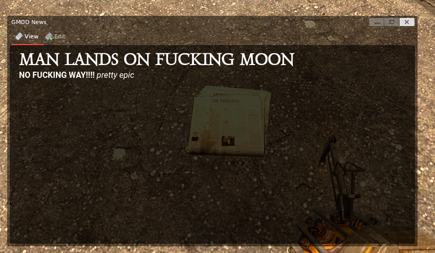
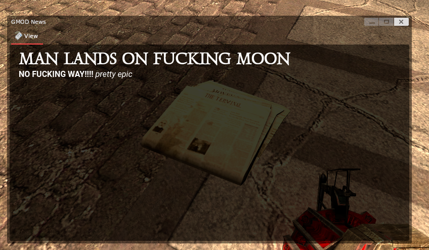
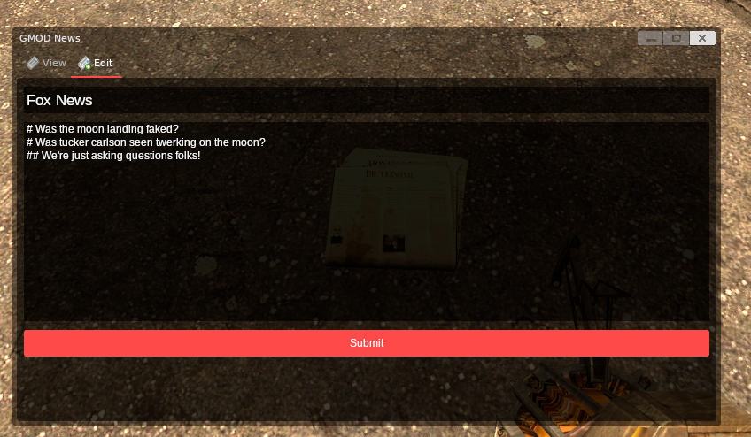

# Newspaper System

The Newspaper System is a simple newspaper entity for DarkRP. You can add it to your F4 Menu or just give them out to people.

## Optional Requirements
    - A prop protection system that impliments CPPI to enable proper ownership
        - Addon runs without it, but anyone will be able to edit anyone's newspaper

## Features
    - Markdown Support
        - Uses DHtml to render markdown, I've tried to secure this to the best of my ability.
        - You should use [CFC-Servers/gm_path_traversal_mitigation](https://github.com/CFC-Servers/gm_path_traversal_mitigation) just incase to prevent bad actors from stealing files.
    - Different publications
    - No custom models required
    - Looks *fine* compared to some other derma menus

## Screenshots

**Main Menu - Edit Permissions**

**Main Menu - No Edit Permissions**

**Edit Menu**

